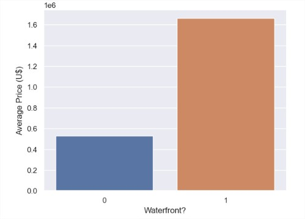
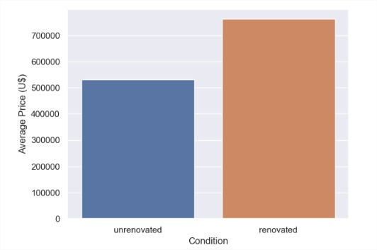
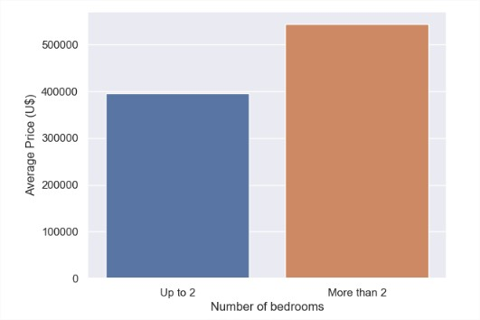
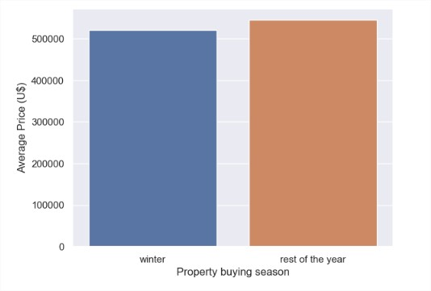
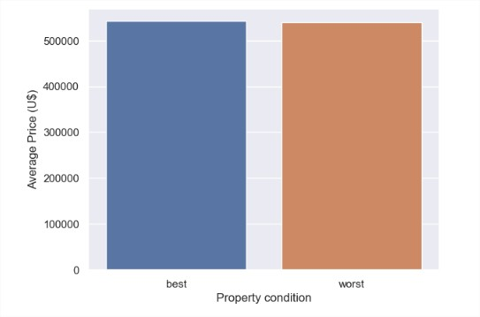

## Projeto de Insights 

### Solução de Negócios para Empresa Imobiliária - Empresa House Rocket.  

*A base de dados foi coletada do Kaggle. Ainda que a base de dados seja real, a empresa e o problema de negócio são fictícios.*  
 [Clique aqui para ter acesso à base de dados original do Kaggle](https://www.kaggle.com/datasets/harlfoxem/housesalesprediction) 

------------------
### Problema de Negócio

A **House Rocket** é uma plataforma digital cujo modelo de negócios é a compra e venda de imóveis por meio de tecnologia.

Sua principal estratégia é comprar casas em bom estado, com ótima localização, a preços baixos e depois revendê-las a preços mais altos, aumentando assim o lucro e a receita da empresa.

Porém, a equipe comercial tem que lidar com diversas variáveis que influenciam o preço, tornando-o mais ou menos atrativo para compradores e vendedores; Além disso, a quantidade de dados é grande e levaria muito tempo para fazer o trabalho manualmente.

O objetivo deste projeto é ajudar o CEO a decidir quais são as melhores casas para comprar e quais são os melhores preços e época do ano para vendê-las; bem como exibir o lucro obtido através de um aplicativo acessível em qualquer dispositivo com acesso à internet. 
 
--------------------------
#### Visão Geral dos Dados 

  
Clique aqui para ver a descrição das colunas.

  
|Atributo 	                        |Definição |
| :---                            |     :---          |
|id 	                            | ID exclusivo de cada propriedade no banco de dados |
|date 	                          | Data de venda do imóvel|
|price 	                          | Preço de venda do imóvel|
|bathroms 	                      | Número de banheiros. Onde 0,5 representa um quarto com banheiro, mas sem chuveiro; 0,75 representa um banheiro que contém pia, vaso sanitário, chuveiro ou banheira. Um banheiro completo tem tradicionalmente uma pia, uma privada, um chuveiro e uma banheira
|sqft_living                      |	Metragem quadrada (em pés) do espaço interior do imóvel |
|sqft_lot                         |	Metragem quadrada do espaço de terra|
|floors                           |	Número de andares do imóvel|
|waterfront                       |	Coluna que representa se o imóvel tem ou não vista mar/lago. 0 representa sem vista para a água e 1 representa vista para a água |
|view                             |	Índice de 0 a 4 de quão boa é a vista do imóvel. 0 é a pior vista e 4 é a melhor vista|
|condition                        |	Índice de 1 a 5 na condição (usado) do imóvel. 1 é a pior condição e 5 é a melhor |
|grade                            |	Índice de 1 a 13 na condição de construção e projeto do imóvel. 1 é a pior nota e 13 é a melhor nota |
|sqft_above                       |	Metragem quadrada (em pés) do espaço interior do imóvel acima do nível do solo|
|sqft_basement                    |	Metragem quadrada (em pés) do espaço interno da propriedade abaixo do nível do solo (porão).|
|yr_built 	                      | Ano em que o imóvel foi construído|
|yr_renovated 	                  | Ano da última reforma do imóvel|
|zipcode                          |	Código postal da propriedade|
|lat                              |	Ponto de latitude da propriedade|
|long                             |	Ponto de longitude da propriedade|
|sqft_living15                    |	Metragem quadrada (em pés) do espaço interior para os 15 vizinhos mais próximos|
|sqft_lot15                       |	A metragem quadrada (em pés) do terreno (lotes vazios) dos 15 vizinhos mais próximos | 

--------------------------

### Presunções

* A linha correspondente a um imóvel com 33 quartos foi retirada por ter sido considerada um erro de digitação.
* Foram considerados sem reforma imóveis com ano de renovação igual a zero ou coluna yr_renovated = 0.
* Foram considerados como sem porão os imóveis com área de porão igual a zero ou sqft_basement = 0.

--------------------------

### Estratégia de Solução

Após a análise exploratória que validou hipóteses e gerou insights, traçando gráficos iterativos para demonstrá-los, os dados foram agrupados por região e o preço médio por região foi calculado. 

Foram sugeridas propriedades com valor abaixo da mediana do preço para sua região. Em seguida, foram calculadas as medianas do preço do grupo formado por estação do ano de venda e região de cada imóvel. O maior preço foi atribuído à melhor época do ano para venda naquela região.

Estas últimas medianas foram utilizadas como parâmetro para definir o preço de venda: Se o preço do imóvel for inferior a esta mediana, o preço sugerido é o preço do imóvel + 30%. Se for maior, será o preço + 10%. 

Foi calculado o lucro de cada imóvel, que consiste na diferença entre o preço do imóvel e o preço sugerido de venda. Os dados foram plotados em uma tabela.

Foram adicionados então, filtros de insights criados com a biblioteca streamlit, uma tabela de resultados financeiros que consiste na soma das linhas (número de propriedades), soma do preço da propriedade (investimento total) e soma dos lucros individuais (lucro total) da tabela de sugestões filtradas. A biblioteca Folium foi utilizada para criar o mapa das propriedades sugeridas. A biblioteca streamlit também foi utilizada para fazer o design do aplicativo que foi hospedado no streamlit cloud e pode ser acessado em qualquer dispositivo com internet. 

--------------------------

### Top 5 insights de negócio

* Dado que os imóveis de frente para o mar são 212,64% mais caros, recomenda-se não comprá-los 

* Como os imóveis reformados são 43,37% mais caros do que os não reformados e o período de reforma ainda aumenta o preço (os reformados depois de 2000 são em média 43,48% mais caros), é recomendável comprar imóveis não reformados e reformar depois.

* Como os imóveis de até 2 quartos são, em média, 37,27% mais baratos, é recomendável optar por eles.

* Como os imóveis adquiridos no inverno são, em média, 4,82% mais baratos que no restante do ano, sugere-se a compra de mais imóveis neste período.

* Como os imóveis com melhores condições são em média 0,46% mais caros, e como as condições não influenciam muito no preço de compra, é recomendado optar sempre pelos imóveis com melhores condições

--------------------------

### Acesso ao Produto de Dados 

 [Clique aqui para ter acesso ao aplicativo](https://dsdefreitas-house-rocket-insights-insights-project-app-nrslnt.streamlit.app/)  

 --------------------------

### Resultados Financeiros

Os resultados irão variar de acordo com os filtros de insights escolhidos. Foram recomendadas de **43** a **3775** propriedades. O investimento varia de **US\$12,053,350** a **US\$ 1,483,480,263**; e o lucro obtido de **U\$3,041,615** para **U\$315,284,211.**
 
--------------------------

### Conclusão e Próximos Passos

O aplicativo conseguiu atender aos anseios do modelo de negócios da empresa, selecionando imóveis ideais para compra e revenda. Como próximos passos, pretende-se tornar a aplicação mais veloz, com funcionalidades mais abrangentes, e implentar modelos de machine learning para uma previsão mais assertiva.

